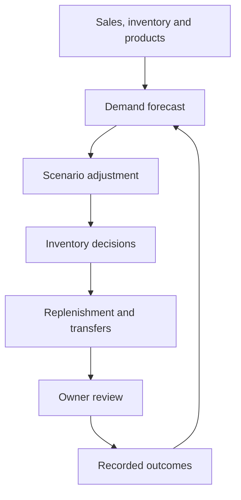

# StorePilot: fashion research for independent retailers
## Overview
StorePilot helps a shop owner investigate affordable fashion before deciding what
to stock. Talk to the fashion scout, inspect recent sources, compare search
interest and retailer prices, then record your own decision. The focus is wearable
clothing for everyday customers, with evidence the owner can question.

The research assistant is a prototype with bounded tools, not an autonomous buyer.
The existing inventory workbench remains available for sales forecasting,
replenishment and locally approved purchase records.
## Contents

- [Overview](#overview)
- [Features](#features)
- [Outcome](#daily-workflow)
- [Start](#getting-started)
- [Fashion scout](#fashion-scout)
- [Forecast evaluation](#forecast-evaluation)
- [Input_data](#input-data)
- [Structure](#project-structure)
- [Decision](#decision-flow)
- [Current_scope](#current-scope)
- [License](#license)


## Features

- conversational fashion research with Google Gemini choosing read-only research tools;
- recent public search excerpts, Google Trends checks and retailer price examples through SerpApi;
- source-linked observations, interpretations and suggestions, with a local research journal;
- owner decisions: keep watching, consider a small trial, or pass, with notes for later conversations;
- 1/7/30-day SKU demand forecasts with uncertainty ranges;
- historical forecast evaluation against weekly-repeat and 28-day-average baselines;
- adjustable conservative, balanced and growth strategies;
- replenishment, overstock, stockout and expiry-risk recommendations;
- price, promotion, holiday, traffic and supplier-delay simulations;
- stock-transfer suggestions when multiple stores are imported;
- human feedback records and adaptive model retraining;
- supplier-grouped purchase orders;
- Chinese and English navigation, forms, charts, exports, and daily reports.


## Daily Workflow

1. Review the overview's stock concerns for the current store.
2. Open **补货清单**, inspect a product's stock position and delivery assumptions,
   then accept the quantity, change it, or choose not to purchase.
3. Open **采购与记录**. Check the supplier-grouped draft and approve it locally.
4. Download the approved order. Arrange delivery with the supplier separately.

Manual edits update the draft quantity and cost. Case packs and minimum orders
are enforced, and the full batch budget is checked again before approval.
An approved order is an immutable snapshot; repeating approval returns the same
order. New data or a different inventory policy creates a new review batch.
Check historic orders before purchasing again.

## Getting started

Python 3.11 or newer is required. The release checks use Python 3.12.

```bash
python -m venv .venv
source .venv/bin/activate
python -m pip install -e ".[dev]" -c constraints-tested.txt
streamlit run app.py
```

On Windows PowerShell, activate with `.venv\Scripts\Activate.ps1`.
The app opens on **Fashion scout / 时尚侦察员**, with an optional, clearly labelled
example conversation. The inventory workbench has sample data for one store,
`STORE-01`. Sales and stock
from the original two demo stores are combined, preserving total quantities and
sales revenue. The store is selected automatically; transfer navigation appears
only when multiple stores are imported. The demo and downloadable
CSV examples contain non-food household essentials: cleaning products, laundry
supplies, toiletries, and paper goods. Uploaded product names and categories are
preserved; uploads are not restricted to this sample catalog.

Choose **中文** or **English** using **Language / 语言** in the sidebar. The choice
applies throughout the current session and leaves store selections, purchasing
preferences, and saved reviews intact. Sample product names and example CSV
values follow the selected language; import column names stay unchanged. Amounts
remain in CNY in both languages.

Import your own files through **Data & settings → Import data**
(**数据与设置 → 导入数据**). The inventory tools and example walkthrough work
without API keys. Live fashion research requires the services below.

## Fashion scout

1. Choose **Live research** and select your store's country. Add your city, customer
   group, clothing categories and typical selling-price range where useful.
2. Connect a **Gemini API key** for the conversational model and a **SerpApi key**
   for search, interest-over-time and retailer-listing data. Password fields keep
   keys out of exported research and the local journal. You can instead configure
   `GEMINI_API_KEY` and `SERPAPI_API_KEY` in the server environment.
3. Ask a practical question, for example: “I sell casual womenswear at €25–60 in
   Germany. Which everyday trouser styles should I investigate this autumn?
   Check search interest and affordable examples, and explain what is uncertain.”
4. Follow up naturally: “Those look too formal. What would suit university
   students?” or “What evidence argues against trying that style?”
5. Open the cited sources and **Evidence and working notes**. Record your own
   judgement under **Your decision**. This does not submit orders or change stock.

Each turn allows at most six data requests and seven model requests. Questions,
store context, recent conversation/evidence and saved decision notes are sent to
the model; search phrases go to the data provider. Provider charges may apply.
There are no background searches. Successful replies and decisions stay in local
SQLite journals; the example uses a separate journal.

This version checks search attention and retail availability, not what “most
people love.” Instagram searches cover only publicly indexed excerpts. It does
not connect directly to Instagram engagement analytics or Amazon sales data, and
does not yet estimate how many weeks a style takes to reach your customers.
See [setup, architecture and research limits](docs/FASHION_SCOUT.md).

## Forecast evaluation

Open **Forecast evaluation / 预测评估** and click **Run forecast evaluation**.
It compares the current gradient-boosting model with two simple baselines at
historical cutoffs, using only the data available at each cutoff. The 1-, 7- and
30-day windows show daily error, total-demand error, WAPE and bias. Product-level
scores and excluded series are available below the comparison.

The default dashboard settings need at least 114 consecutive daily records per
store-product series. Include explicit zero-sales days; missing dates are not
treated as zero sales for evaluation. Computation runs on demand and results
survive language changes and navigation. Download the report or the complete
experiment ZIP to inspect predictions, scores and settings.

For a fixed-date demo experiment that can be rerun from the terminal:

```bash
python -m storepilot.evaluate --output evaluation_output
```

This uses 210 days of synthetic data, seed 42, ending on 2026-09-18, with three
cutoffs 30 days apart. See [the evaluation guide](docs/EVALUATION.md) for imported
data and metric definitions, and [the demo report](docs/forecast-evaluation-demo.md)
for the recorded experiment. Synthetic results do not establish real-store
accuracy or inventory savings. Evaluation does not replace the production model
or change purchasing decisions automatically.

## Input data

### `sales.csv`

Required: `date, store_id, sku, units`. Optional: `price, promotion, stockout`.

### `products.csv`

Required: `sku, product_name, category, supplier_id, cost, price`. Optional:
`shelf_life_days, lead_time_days, case_pack, min_order_qty`.

### `inventory.csv`

Required: `store_id, sku, on_hand`. Optional: `on_order`.

See `docs/DATA_SCHEMA.md` for validation rules and examples.

## Project structure

```text
storepilot/
├── app.py                       Streamlit dashboard
├── storepilot/
│   ├── forecasting.py          demand model and uncertainty intervals
│   ├── fashion_agent.py        bounded research agent and owner-decision journal
│   ├── fashion_sources.py      search, interest and retailer-price tools
│   ├── fashion_page.py         conversation and evidence interface
│   ├── evaluation.py           historical comparisons, scores and reports
│   ├── evaluate.py             reproducible experiment command
│   ├── optimization.py         reorder, budget and transfer decisions
│   ├── scenarios.py            what-if adjustments
│   ├── repository.py           SQLite feedback and model-run history
│   ├── i18n.py                 Chinese and English interface messages
│   └── reporting.py            Daily operating reports
├── tests/                       unit and integration tests
└── docs/DATA_SCHEMA.md          input contracts
```

## Decision flow



## Current scope

The fashion scout's adapters and conversations have automated tests with recorded
response shapes and test doubles. A live end-to-end run requires your provider
credentials and has not been verified against your accounts. No real-world trend
prediction or purchasing benefit has been established yet.

The core calculations, schemas, feedback persistence and exports are working.
For a commercial deployment, add POS/supplier integrations, authentication,
database migrations, scheduled retraining, monitoring and a controlled A/B
pilot before enabling automatic order submission.

## Safety rule

Purchase orders are generated as drafts. The MVP never sends an order to a
supplier automatically; an owner must approve it first.

## Contributing

See [CONTRIBUTING.md](CONTRIBUTING.md) for the local checks and pull-request
requirements. Changes to forecasting or replenishment behaviour should include
a focused test and a short explanation of the business assumption being changed.

## License

Copyright © 2026 Jingming Yang. All rights reserved. See [LICENSE](LICENSE).
