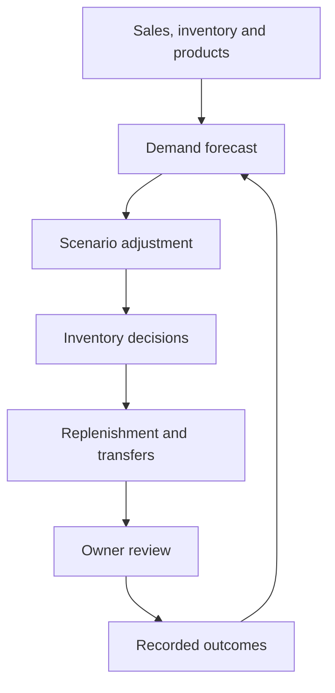

# StorePilot-AI: A closed-loop AI system for autonomous retail operations
## Overview
StorePilot intends to develop an AI-powered deicision making system, targeting grocery stores and small retailing scenarios. This system should be functional in providing fully considered suggestions regarding replenishment, allocation, promotion, inventory reduction and procurement recommendations.
## Contents

- [Overview](#overview)
- [Features](#features)
- [Outcome](#daily-workflow)
- [Start](#getting-started)
- [Input_data](#input-data)
- [Structure](#project-structure)
- [Decision](#decision-flow)
- [Current_scope](#current-scope)
- [License](#license)


## Features

- 1/7/30-day SKU demand forecasts with uncertainty ranges;
- adjustable conservative, balanced and growth strategies;
- replenishment, overstock, stockout and expiry-risk recommendations;
- price, promotion, holiday, traffic and supplier-delay simulations;
- multi-store stock-transfer suggestions;
- human feedback records and adaptive model retraining;
- supplier-grouped purchase orders;
- a daily Chinese management report.


## Daily Workflow

1. Choose a store in the sidebar and review the overview's stock concerns.
2. Open **补货清单**, inspect a product's stock position and delivery assumptions,
   then accept the quantity, change it, or choose not to purchase.
3. Open **采购与记录**. Check the supplier-grouped draft and approve it locally.
4. Download the approved order. Arrange delivery with the supplier separately.

Manual edits update the draft quantity and cost. Case packs and minimum orders
are enforced, and the full batch budget is checked again before approval.
An approved order is an immutable snapshot; repeating approval returns the same
order. New data or a different inventory policy creates a new review batch.
Check historic orders before purchasing again.

## Getting started

Python 3.11 or newer is required. The release checks use Python 3.12.

```bash
python -m venv .venv
source .venv/bin/activate
python -m pip install -e ".[dev]" -c constraints-tested.txt
streamlit run app.py
```

On Windows PowerShell, activate with `.venv\Scripts\Activate.ps1`.
The app opens with labelled sample data from two stores. Import your own files
through **数据与设置 → 导入数据**. No external model service or API key is needed.

## Input data

### `sales.csv`

Required: `date, store_id, sku, units`. Optional: `price, promotion, stockout`.

### `products.csv`

Required: `sku, product_name, category, supplier_id, cost, price`. Optional:
`shelf_life_days, lead_time_days, case_pack, min_order_qty`.

### `inventory.csv`

Required: `store_id, sku, on_hand`. Optional: `on_order`.

See `docs/DATA_SCHEMA.md` for validation rules and examples.

## Project structure

```text
storepilot/
├── app.py                       Streamlit dashboard
├── storepilot/
│   ├── forecasting.py          demand model and uncertainty intervals
│   ├── optimization.py         reorder, budget and transfer decisions
│   ├── scenarios.py            what-if adjustments
│   ├── repository.py           SQLite feedback and model-run history
│   └── reporting.py            Chinese daily operating report
├── tests/                       unit and integration tests
└── docs/DATA_SCHEMA.md          input contracts
```

## Decision flow



## Current scope

The core calculations, schemas, feedback persistence and exports are working.
For a commercial deployment, add POS/supplier integrations, authentication,
database migrations, scheduled retraining, monitoring and a controlled A/B
pilot before enabling automatic order submission.

## Safety rule

Purchase orders are generated as drafts. The MVP never sends an order to a
supplier automatically; an owner must approve it first.

## Contributing

See [CONTRIBUTING.md](CONTRIBUTING.md) for the local checks and pull-request
requirements. Changes to forecasting or replenishment behaviour should include
a focused test and a short explanation of the business assumption being changed.

## License

Copyright © 2026 Jingming Yang. All rights reserved. See [LICENSE](LICENSE).
