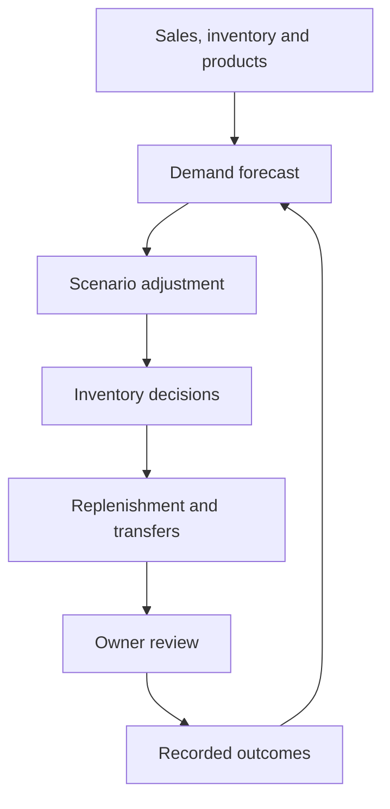

# StorePilot-AI: A closed-loop AI system for autonomous retail operations
## Overview
StorePilot intends to develop an AI-powered deicision making system, targeting grocery stores and small retailing scenarios. This system should be functional in providing fully considered suggestions regarding replenishment, allocation, promotion, inventory reduction and procurement recommendations.
## Contents

- [Overview](#overview)
- [Features](#features)
- [Outcome](#outcome-daily-workflow)
- [Start](#getting-started)
- [Input_data](#input-data)
- [Structure](#project-structure)
- [Decision](#decision-flow)
- [Current_scope](#current-scope)
- [License](#license)


## Features

- 1/7/30-day SKU demand forecasts with uncertainty ranges;
- adjustable conservative, balanced and growth strategies;
- replenishment, overstock, stockout and expiry-risk recommendations;
- price, promotion, holiday, traffic and supplier-delay simulations;
- multi-store stock-transfer suggestions;
- human feedback records and adaptive model retraining;
- supplier-grouped purchase orders;
- a daily Chinese management report.


## Outcome: Daily Workflow

The intended StorePilot AI workflow minimizes the amount of manual inventory analysis required from store owners.

Each day, the store owner only needs to:

1. Read the automatically generated **daily business report**.
2. Review products flagged as **high-risk or anomalous**.
3. Accept or modify **replenishment, promotion, and inventory-transfer recommendations**.
4. Review and approve automatically generated **purchase orders**.
5. Allow the system to observe actual outcomes and **continuously improve its models and future decisions**.

The long-term objective is to transform StorePilot AI from a forecasting tool into an **adaptive retail decision engine** capable of supporting increasingly autonomous store operations.


## Getting started

```bash
python -m venv .venv
source .venv/bin/activate       # Windows: .venv\Scripts\activate
pip install -e .
streamlit run app.py
```

The dashboard starts with a reproducible two-store sample dataset. Turn off
**Use built-in demo data** in the sidebar to upload store data as CSV files.

To verify the core system without starting the dashboard:

```bash
python -m storepilot.demo
python -m unittest discover -s tests -v
```

## Input data

### `sales.csv`

Required: `date, store_id, sku, units`. Optional: `price, promotion, stockout`.

### `products.csv`

Required: `sku, product_name, category, supplier_id, cost, price`. Optional:
`shelf_life_days, lead_time_days, case_pack, min_order_qty`.

### `inventory.csv`

Required: `store_id, sku, on_hand`. Optional: `on_order`.

See `docs/DATA_SCHEMA.md` for validation rules and examples.

## Project structure

```text
storepilot/
├── app.py                       Streamlit dashboard
├── storepilot/
│   ├── forecasting.py          demand model and uncertainty intervals
│   ├── optimization.py         reorder, budget and transfer decisions
│   ├── scenarios.py            what-if adjustments
│   ├── repository.py           SQLite feedback and model-run history
│   └── reporting.py            Chinese daily operating report
├── tests/                       unit and integration tests
└── docs/DATA_SCHEMA.md          input contracts
```

## Decision flow



## Current scope

The core calculations, schemas, feedback persistence and exports are working.
For a commercial deployment, add POS/supplier integrations, authentication,
database migrations, scheduled retraining, monitoring and a controlled A/B
pilot before enabling automatic order submission.

## Safety rule

Purchase orders are generated as drafts. The MVP never sends an order to a
supplier automatically; an owner must approve it first.

## Contributing

See [CONTRIBUTING.md](CONTRIBUTING.md) for the local checks and pull-request
requirements. Changes to forecasting or replenishment behaviour should include
a focused test and a short explanation of the business assumption being changed.

## License

Copyright © 2026 Jingming Yang. All rights reserved. See [LICENSE](LICENSE).
