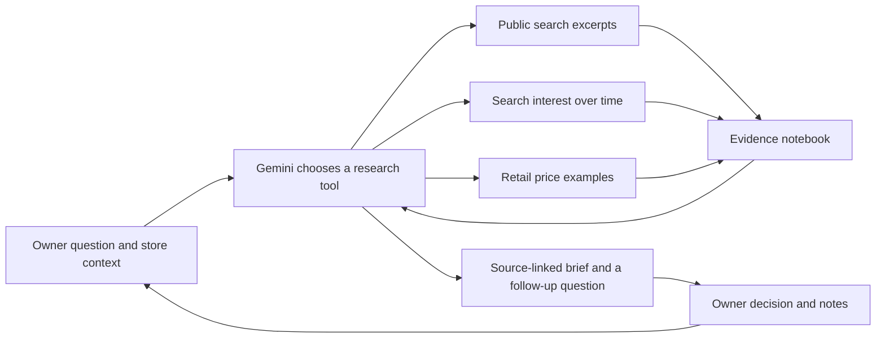

# Fashion scout

The owner starts with a question, not a chart: “What everyday styles might suit
my customers next?” The assistant investigates candidates, shows where each
finding came from, and asks about practical details. The owner decides whether
to watch, try a small batch, or pass.

## Connect the first live conversation

Run the app with the existing virtual environment:

```bash
source .venv/bin/activate
streamlit run app.py
```

Open **Fashion scout → Live research**. Select the country where you sell, then
add your customers, garment categories and usual retail prices. The country
controls search localization and budget currency; it does not establish the
preferences of the city's shoppers. The city and customer description guide
research questions rather than becoming measured demographic data.

Use two separate credentials:

| Credential | Purpose | Obtain it from |
| --- | --- | --- |
| Gemini API key | Conversational reasoning and selection of research tools | [Google AI Studio](https://aistudio.google.com/apikey) |
| SerpApi key | Public search excerpts, Google Trends observations and retailer listings | [SerpApi](https://serpapi.com/manage-api-key) |

A Google Maps key is not a Gemini key. SerpApi is a third-party provider; this is
not a connector to Google's restricted official Trends API. You can apply for
[Google Trends API alpha access](https://developers.google.com/search/apis/trends)
separately, but that connector is not implemented here.

Paste keys only into the password fields in the application, or configure the
server environment variables `GEMINI_API_KEY` and `SERPAPI_API_KEY`. The model
defaults to `gemini-3.8-flash`; the connection panel or
`STOREPILOT_GEMINI_MODEL` can select another compatible Gemini model available
to your account. No new Python dependency is required.
The default follows Google's current model guidance; older 2.5 models have
[restricted access for new users](https://ai.google.dev/gemini-api/docs/deprecations).

One turn can call the model up to seven times and data tools up to six times.
This is a request-count limit, not a price estimate. Check your provider plans.
Questions, the store profile, the last four exchanges, retained evidence and up
to ten recent owner decisions are sent to Gemini. Search queries are sent to
SerpApi. Credentials are sent only to the corresponding fixed provider endpoint.
There are no automatic background searches or purchases.

Try a narrow first question:

> My customers buy casual trousers at €25–60. Find two everyday styles to
> investigate in Germany. Check current retail examples and recent search
> interest, and tell me which evidence is missing.

Then challenge the answer: “Are those examples mostly luxury coverage?”,
“What supports this outside social media?”, or “How would I test this idea
without committing to a large order?”

## How the agent works



This is a tool-using language-model agent: tool choices depend on the conversation
and returned observations. The application validates tool names and arguments,
prevents repeated identical requests, limits calls, and accepts a final structured
brief only when its cited IDs exist in the evidence notebook. Read-only tools
cannot execute shell commands, place orders or send messages.

The final answer separates **observations**, **interpretations** and
**suggestions**. Observations and interpretations require source IDs; a practical
suggestion can be explicitly unsourced. The assistant is instructed to check
ordinary retail prices and wearable use cases rather than treating luxury press
as proof of broad popularity. This instruction is not a trained social-class
classifier or evidence about a whole population.

Citation validation checks that a source was retrieved, not that every sentence
is logically entailed by that source. Inspect sources before acting. Search
excerpts, prices and charts are shown so you can challenge the assistant's
interpretation. Model errors remain possible. The visible working notes record
actual tool calls, not a claimed transcript of the model's internal reasoning.

## What the data tools mean

**Public search.** Searches request results from the past three months in the
selected market. The notebook stores short excerpts, URLs, queries and any date
label supplied by search. Collection time and publication date are different.
Results without publication labels are not silently treated as newly published.
Instagram mode adds `site:instagram.com`; it covers indexed public pages, not a
representative feed, hashtag-volume history or platform-wide likes.

**Search interest.** One phrase and region are requested over the past 12 months.
The app uses complete, regularly spaced weekly records, omitting observations
less than seven days old and any explicitly partial points. It compares the mean
of the last four complete weeks with the preceding four weeks. Missing, stale,
irregular or very low-volume data produce an unavailable change rather than a
made-up zero or an inflated growth percentage. It does not compare independently
normalized index levels as absolute popularity across products or countries.
Search attention is not consumer approval, purchases or causal evidence of
fashion spreading between regions.

**Retail prices.** Up to six distinct listing examples are retained. Budget
matches require a recognized currency matching the store's currency. Unknown
currency is marked unknown; no exchange rate is invented. A listing proves an
asking price was returned, not that the item sells well, ships to your shop, or
is available from a wholesaler. Check garment relevance, sizes, shipping and
retailer details yourself. No listing-count popularity score is used.

## Decisions and persistence

Successful replies are saved in `storepilot-fashion.db`, alongside their sources
and tool records. Owner decisions record the item, judgement, note and related
research turn. Later conversations with the same profile receive those notes as
context; this is memory, not model training or proof that a recommendation worked.

The example uses invented evidence in `storepilot-fashion-demo.db` and never enters
live research. Both files are ignored by Git. When `STOREPILOT_DB` is configured,
the research filenames use the same directory and filename stem. The ordinary
inventory and purchase database is not used by the scout.

Profiles partition conversation history: changing the country, customer group or
budget shows a different conversation. Switching interface language does not make
API calls. New replies follow the selected language; past model replies retain
their original language. The downloadable JSON contains the brief and evidence,
not credentials or the original unfiltered provider responses.

## What is verified, and what remains research

Automated tests cover the tool loop, call limits, follow-up context, rejected
citations, HTTP error redaction, incomplete interest series, currency checks,
local persistence, demo/live separation and the Streamlit conversation flow.
They use test doubles and provider response shapes. A live run with the owner's
accounts is still required to verify credentials, model availability, provider
quotas and actual result quality. Demo output is deliberately fictional.

This version does not estimate a geographic trend-arrival delay. It also does
not access Amazon sales or authenticated Instagram engagement, perform image
clustering, or estimate a customer's probability of buying. Those would require
additional data access and evaluation. The conversational research workflow is
the implemented scope.

For a graduate-project investigation, a concrete next study is whether adding
external signals improves an owner's shortlist over local sales history alone:

1. Save dated research briefs before outcomes are known, including rejected ideas.
2. With appropriate shop data, record subsequent enquiries, trial quantities,
   sell-through and markdowns over a fixed window. Include unsuccessful trials.
3. Compare local-history-only, external-signals-only and combined recommendations
   using a later period kept out of development.
4. Test geographic delay only after collecting repeated source-market and local
   observations. Compare against no-delay and seasonal baselines; report cases
   where the proposed delay fails.

That would test the distinctive local-adoption hypothesis. The current agent
provides an auditable workflow for collecting evidence; it does not establish
novel forecasting accuracy or guarantee any admissions outcome.

## Provider references

- [Gemini content generation and function calls](https://ai.google.dev/api/generate-content)
- [SerpApi Google search](https://serpapi.com/search-api)
- [SerpApi Google Trends](https://serpapi.com/google-trends-api)
- [Interest-over-time response](https://serpapi.com/google-trends-interest-over-time)
- [Google Shopping response](https://serpapi.com/google-shopping-api)
- [Amazon Creators API access requirements](https://affiliate-program.amazon.com/creatorsapi/docs/)

Checked while implementing this feature on 2026-09-27. Provider access rules and
models can change; these links are also the starting point for future connectors.
